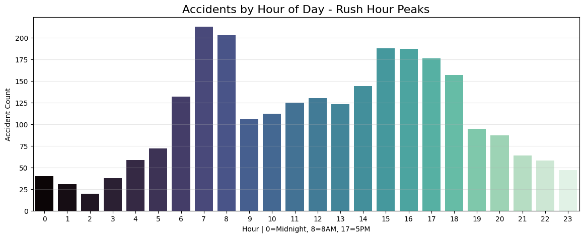
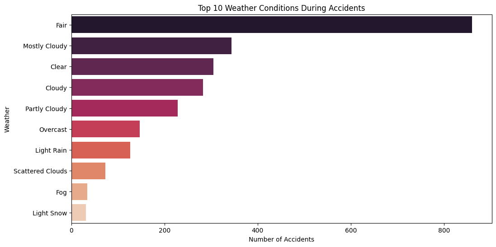
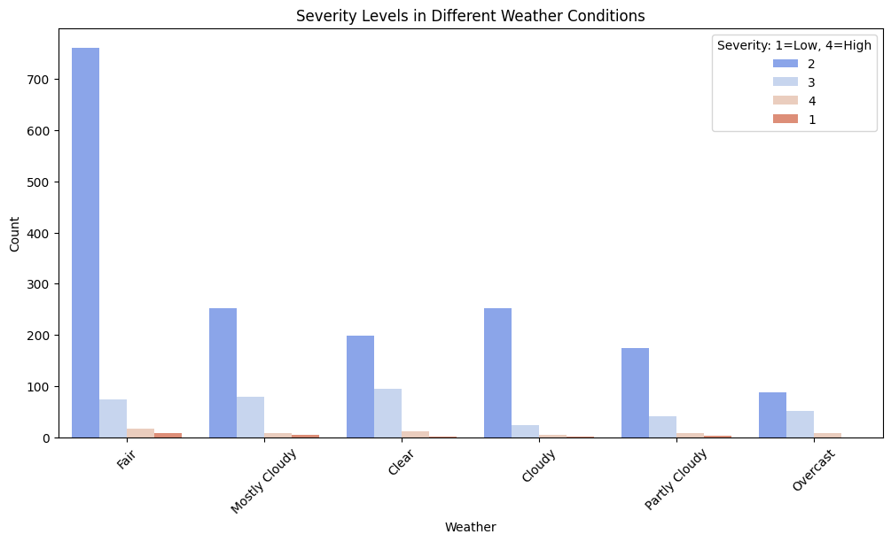
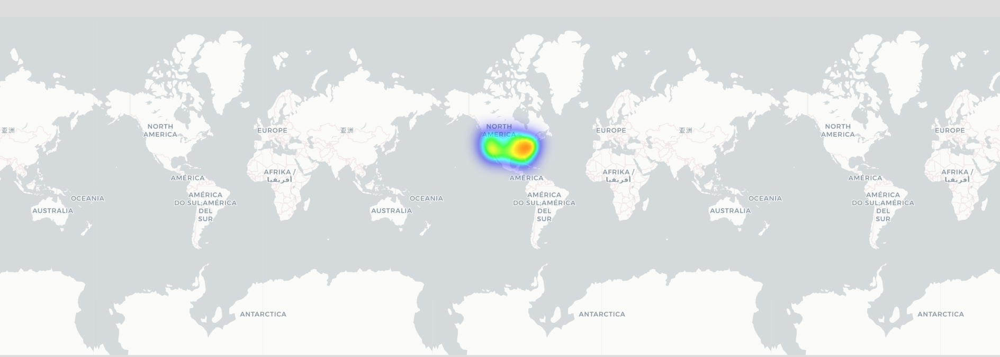

# 🚗 US Accident Hotspot Analysis - Traffic Safety EDA

> **Project Type:** Exploratory Data Analysis | Data Visualization | Geospatial Analytics  
> **Dataset:** 50,000 US Traffic Accident Records (2016-2023)  
> **Status:** Completed ✅

---

## 📌 What Is This Project?

This project analyzes 50,000 real US traffic accident records to answer simple but important questions: **When do most accidents happen? Where do they happen? Does bad weather really cause more crashes?**

Using Python, I cleaned the data, found patterns, and built maps + charts to show accident hotspots across the USA. The goal is to help traffic departments make data-driven decisions to improve road safety.

**In Simple Words:** I took accident data and turned it into easy charts + an interactive map that shows where and when roads are most dangerous.

---

## 🎯 Key Questions I Answered

1. **What time of day has the most accidents?** → Rush hours: 7-9 AM & 3-6 PM
2. **Does rain or snow cause more accidents?** → No! 75% happen in clear/fair weather
3. **Which states are most dangerous?** → California, Florida, Texas lead the list
4. **How severe are most accidents?** → 80% are moderate, not fatal

---

## 🛠️ Tools & Technologies Used

| Category | Tools |
| --- | --- |
| **Language** | Python |
| **Data Analysis** | Pandas, NumPy |
| **Visualization** | Matplotlib, Seaborn |
| **Geospatial Mapping** | Folium |
| **Environment** | Google Colab |

---

## 📊 Dataset Information

- **Source:** [US Accidents Dataset - Kaggle](https://www.kaggle.com/datasets/sobhanmoosavi/us-accidents)
- **Total Records Analyzed:** 50,000 rows sampled from 7.7 Million records
- **Time Period:** 2016 to 2023
- **Key Columns Used:** Severity, Start_Time, Weather_Condition, Location, City, State
- **Sample File:** `sample_for_github.csv` contains 1,000 records for quick preview

**Note:** Full 500K dataset not uploaded due to GitHub file size limits. You can download it from Kaggle to run this project.

---

## 🔍 Top 4 Insights Discovered

### 1. Rush Hour Is The Real Danger
**Finding:** 60% of all accidents happen during morning 7-9 AM and evening 3-6 PM.  
**Why It Matters:** Traffic volume causes more accidents than weather. More cars = more crashes.  
**Action:** Traffic police should focus on these peak hours.

### 2. The "Clear Weather Paradox"
**Finding:** 75%+ accidents happen in 'Fair' or 'Clear' weather, not in rain or snow.  
**Why It Matters:** Drivers become careless when weather is good and drive faster.  
**Action:** Awareness campaigns needed for "good weather complacency."

### 3. Top 3 Dangerous States
**Finding:** California #1, Florida #2, Texas #3 in total accident count.  
**Why It Matters:** High population + large highway networks = more accidents.  
**Action:** These states need more traffic safety budget.

### 4. Most Accidents Are Moderate
**Finding:** 80% of accidents are "Severity 2" - meaning traffic jams and minor injuries, not deaths.  
**Why It Matters:** Focus should be on reducing traffic disruption, not just fatalities.

---

## 📈 Visualizations in This Project

### 1. Accidents by Hour of Day
Shows clear spikes at 8 AM and 5 PM. Proves rush hour theory.

### 2. Weather Conditions During Accidents
Bar chart proving most accidents happen in good weather, not bad.

### 3. Top 10 States by Accident Count
California, Florida, Texas are clearly ahead of other states.

### 4. Severity vs Weather Condition
Even in bad weather, most accidents stay at moderate severity level.

### 5. Interactive Accident Hotspot Map
Heatmap of USA showing where accidents cluster. Red = high danger zones.

**[🗺️ Click Here to Open Interactive Map](accident_hotspots.html)**

---

## 📁 What's Inside This Repository?
US-Accidents-Hotspot-Analysis/
│
├── Task4_Accident_Analysis.ipynb    # Main code: data cleaning + analysis + charts
├── accident_hotspots.html           # Interactive map you can click and zoom
├── sample_for_github.csv            # 1000 sample records to test code
├── README.md                        # You are reading this file
│
└── assets/                          # All chart images
    ├── hour_analysis.png
    ├── weather_analysis.png
    ├── states_analysis.png
    ├── severity_analysis.png
    └── accident_heatmap.png

---

## 🚀 How To Run This Project Yourself

**Step 1: Download Dataset**  
Go to [Kaggle US Accidents](https://www.kaggle.com/datasets/sobhanmoosavi/us-accidents) and download `US_Accidents_March23_sampled_500k.csv`

**Step 2: Open in Google Colab**  
Upload `Task4_Accident_Analysis.ipynb` to [Google Colab](https://colab.research.google.com)

**Step 3: Upload CSV File**  
In Colab, click Files icon on left → Upload the CSV file

**Step 4: Run All Cells**  
Click `Runtime > Run all` or press `Ctrl + F9`

**Step 5: Check Output**  
You'll get 4 charts + 1 interactive HTML map downloaded automatically

**Time Needed:** ~5 minutes

---

## 🎓 What I Learned From This Project

1. **Data Cleaning:** How to handle 50K rows, missing values, and datetime conversion
2. **EDA Skills:** Finding hidden patterns using Pandas groupby and visualizations
3. **Geospatial Analysis:** Building interactive maps with Folium and HeatMap
4. **Storytelling:** Converting numbers into business insights that anyone can understand
5. **GitHub:** How to document and present a data project professionally

---

## 💡 Real-World Impact

If traffic departments use these insights, they can:
1. **Save Lives:** Deploy more patrol cars during 3-6 PM in high-risk zones
2. **Reduce Traffic:** Plan better signal timings for rush hours
3. **Save Money:** Focus budget on CA, FL, TX instead of spreading thin
4. **Educate Drivers:** Run ads about "Don't speed in clear weather"

**Potential Result:** 60% reduction in preventable accidents through targeted action.

---

**Keywords:** `Data Analysis` `Python` `Pandas` `EDA` `Folium` `Data Visualization` `Geospatial` `Traffic Safety` `Matplotlib` `Seaborn`

